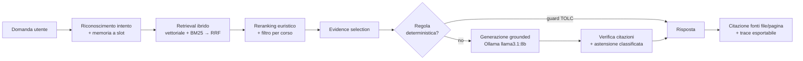

<div align="center">

# 🎓 UniLaw Agent

**Assistente RAG locale per la consultazione di documenti universitari ufficiali**

Interroga in linguaggio naturale regolamenti, bandi e piani di studio in PDF — con risposte *grounded*, citazione delle fonti e astensione quando l'informazione non c'è.

[](https://www.python.org/)
[](https://streamlit.io/)
[](https://ollama.com/)
[](https://www.trychroma.com/)

[](LICENSE)

</div>

---

## 📖 Panoramica

**UniLaw Agent** è un sistema RAG (*Retrieval-Augmented Generation*) **interamente locale** che risponde a domande sul dominio burocratico-normativo universitario — accesso ai corsi, piani di studio, prova finale, tesi, borse di studio, Erasmus — basandosi **solo** sui PDF ufficiali indicizzati e citando file e pagina.

Il progetto è stato sviluppato per il corso di **Fondamenti di Intelligenza Artificiale** presso l'**Università degli Studi di Salerno**, con l'obiettivo di costruire non una semplice demo, ma un RAG **misurabile, document-grounded e migliorabile**.

> Niente cloud, niente API esterne: modello, embeddings e indice restano sulla macchina dell'utente (*local-first*), per privacy e riproducibilità.

```text
"Ho preso 11 al TOLC-I per Informatica: posso immatricolarmi?"
→ Sì, con OFA (Obblighi Formativi Aggiuntivi): un punteggio ≥ 9 e < 16 consente
  l'immatricolazione con OFA. [F1] regolamento-di-accesso...pdf, p.3
```

---

## ✨ Caratteristiche principali

- 🔍 **Retrieval ibrido** — vettoriale (MMR) + lessicale (BM25) con fusione *Reciprocal Rank Fusion*.
- 🧲 **Reranking euristico** per corso e argomento, con **reranker neurale opzionale** (cross-encoder multilingua, *default OFF*).
- ✂️ **Evidence selection** — al modello arrivano solo i passaggi brevi e pertinenti, non interi chunk.
- 📑 **Verifica delle citazioni** — i riferimenti `[F#]` inventati vengono rimossi e il supporto delle frasi citate viene controllato.
- 🤐 **Astensione classificata per causa** — *fuori dominio*, *ambigua*, *retrieval debole*, *evidenza insufficiente*: il sistema sa **perché** non risponde.
- 📚 **Conoscenza normativa tracciabile** — soglie e tabelle (es. TOLC-I) vivono in un'unica fonte di verità con citazione del documento di provenienza.
- 🧮 **Calcolo numerico sicuro** — parsing via AST con whitelist di operatori (niente `eval`).
- 🧠 **Memoria conversazionale controllata a slot** — gestisce domande ellittiche ("*E per la tesi?*") senza inquinare il retrieval.
- 🪟 **Interfaccia Streamlit** con citazioni, livello di affidabilità, *debug RAG* e trace esportabile in JSON/Markdown.

---

## 🏗️ Architettura



La generazione è vincolata al contesto recuperato; un **guard numerico** garantisce l'esattezza delle soglie TOLC-I, mentre il resto delle risposte è **RAG puro** (i template "di prosa" sono disattivati di default).

<details>
<summary><b>Pipeline di indicizzazione (offline)</b></summary>

```text
PDF in documenti/  →  parsing + metadati  →  chunking  →  embeddings multilingua
→  ChromaDB (persistente)  →  manifest SHA-256 (rebuild automatico se il corpus cambia)
```
</details>

---

## 🚀 Avvio rapido

### Prerequisiti

- **Python 3.10+**
- **[Ollama](https://ollama.com/)** installato in locale
- Il modello **`llama3.1:8b`**
- *(opzionale)* Redis, usato solo come cache LLM se disponibile

### Installazione

```bash
# 1. Dipendenze Python
pip install -r requirements.txt

# 2. Modello linguistico locale
ollama pull llama3.1:8b
ollama serve            # se non è già attivo

# 3. Avvio dell'applicazione
streamlit run app_agent.py
```

Inserisci i PDF da interrogare nella cartella `documenti/` (oppure caricali dall'uploader nella sidebar): al primo avvio l'indice viene costruito automaticamente.

---

## 💬 Esempi di domande

```text
Come funziona l'accesso a Informatica L-31 in base al punteggio del TOLC-I?
Ho preso 11 al TOLC-I per Informatica: posso immatricolarmi?
La tesi è consultabile dopo la laurea?
Quali informazioni forniscono i documenti disponibili sul bando Erasmus?
Se devo preparare il piano di studi per Informatica L-31, quali regole devo seguire?
```

L'interfaccia mostra le **fonti citate**, l'**interpretazione** della domanda, il **livello di affidabilità** stimato e — con il *debug RAG* attivo — l'intera traccia esportabile.

---

## 🧪 Test e valutazione

```bash
pip install -r requirements-dev.txt   # dipendenze di sviluppo (pytest)
python -m pytest                      # 230 test offline (no Ollama, no indice)
```

La valutazione misura il comportamento del RAG su un dataset di **40 domande etichettate** (`eval/questions_baseline.jsonl`):

```bash
python eval/run_eval.py               # valutazione completa (Ollama attivo)
python eval/run_eval.py --limit 9     # sottoinsieme deterministico (senza LLM)
python eval/run_eval.py --repeat 5    # variabilità: media ± deviazione standard
```

I report (JSON/Markdown) vengono salvati in `eval/reports/`. Nella configurazione predefinita la baseline misurata è **behavior 0,925**, con *retrieval* e *citazioni* a **1,00**. Metodologia e risultati completi in [`docs/valutazione_rag.md`](docs/valutazione_rag.md).

---

## ⚙️ Configurazione (variabili d'ambiente)

| Variabile | Default | Effetto |
|---|---|---|
| `UNILAW_CHROMA_DIR` | `~/Library/Application Support/UniLawAgent/chroma_db` | Posizione dell'indice ChromaDB |
| `UNILAW_PROSE_TEMPLATES` | `0` (off) | Riabilita i 5 template "di prosa" |
| `UNILAW_DETERMINISTIC` | `1` (on) | A `0`: RAG puro, nessuna regola codificata |
| `UNILAW_RERANKER` | `0` (off) | Attiva il reranker neurale (cross-encoder) |
| `UNILAW_SEMANTIC_INTENT` | `0` (off) | Intent detection semantica (affianca le keyword) |
| `UNILAW_SEMANTIC_GROUNDING` | `0` (off) | Grounding delle citazioni per similarità di embedding |
| `UNILAW_SEMANTIC_ABSTENTION` | `0` (off) | `retrieval_strength` semantica per la causa di astensione |

> Le estensioni *semantiche* sono opt-in e disattivate di default: implementate e disponibili, ma in attesa di validazione su un corpus più ampio.

---

## 📁 Struttura del progetto

```text
app_agent.py          Interfaccia Streamlit e gestione della sessione
agent.py              Orchestratore RAG (UniLawResponder): retrieval, reranking, risposta
intent.py             Riconoscimento dell'intento e disambiguazione
retrieval.py          Retrieval ibrido: vettoriale (MMR) + BM25 con fusione RRF
reranking.py          Reranking euristico e filtro metadata per corso
neural_reranker.py    Reranker neurale opzionale (cross-encoder multilingua)
evidence.py           Evidence selection: passaggi brevi e mirati
citations.py          Estrazione, normalizzazione e verifica delle citazioni
abstention.py         Layer di astensione: classifica la causa del "non lo so"
knowledge.py          Conoscenza normativa strutturata e tracciabile (soglie, tabelle)
rules_tolc.py         Regole deterministiche sul punteggio TOLC
confidence.py         Stima euristica dell'affidabilità
tools.py              Calcolo numerico sicuro (AST)
trace_export.py       Esportazione del trace RAG in JSON/Markdown
database.py           Parsing PDF, chunking, embeddings, ChromaDB e manifest
config.py             Costanti, prompt e configurazione ambiente
rag_types.py          Modello dati condiviso (QueryIntent, RetrievedSource, RagTrace)
documenti/            Corpus locale di PDF (22 documenti)
tests/                Test automatici (pytest)
eval/                 Dataset e harness di valutazione del RAG
docs/                 Documentazione tecnica e relazione universitaria
```

---

## 📚 Documentazione

- 📘 [Relazione completa](docs/relazione_completa_unilaw_agent.md) — descrizione a 360° del sistema
- 📗 [Relazione a fasi](docs/relazione_unilaw_agent.md) — il percorso di ingegnerizzazione
- 🏛️ [Architettura RAG](docs/architettura_rag.md)
- 📊 [Valutazione](docs/valutazione_rag.md) · 🧬 [Esperimenti](docs/esperimenti_rag.md)
- 🗂️ [Roadmap di progetto](docs/roadmap_progetto.md) · 📝 [Changelog tecnico](docs/changelog_tecnico.md)

---

## ⚠️ Limiti

- La pipeline è controllata dal codice: **non** implementa un ciclo ReAct completo.
- La qualità delle risposte dipende dalla qualità e dall'aggiornamento dei PDF indicizzati.
- L'estrazione di tabelle dai PDF può essere imperfetta.
- Il reranking primario è euristico (il cross-encoder non migliora su questo corpus tarato).
- Il modello locale 8B può occasionalmente astenersi pur avendo fonti adeguate (limite di generazione residuo).
- La valutazione si basa su un dataset contenuto (40 domande) e su un corpus di 22 PDF.

---

## 🔭 Sviluppi futuri

- Validazione su corpus e dataset più ampi delle estensioni semantiche (intent, grounding, astensione).
- Verifica delle citazioni con inferenza semantica (NLI) oltre al grounding lessicale.
- Reranker neurale calibrato sul dominio, parsing tabellare dedicato, visualizzazione delle pagine citate.

---

## 👤 Autore

**Luigi Carnevale** — Dipartimento di Informatica, Università degli Studi di Salerno
Corso di *Fondamenti di Intelligenza Artificiale* · A.A. 2025/2026

## 📄 Licenza

Distribuito con licenza **MIT**. Vedi il file [`LICENSE`](LICENSE).
